# 📊 Baserow User Guide

<div align="center">
  

  <h3>Panduan Lengkap Penggunaan Baserow</h3>
  <p>Open-source no-code database platform — alternatif Airtable yang bisa di-self-hosted</p>

  [](https://opensource.org/licenses/MIT)
  [](https://baserow.io/)
  [](https://www.docker.com/)
</div>

---

## 📋 Daftar Isi

- [Sekilas Tentang](#-sekilas-tentang)
- [Instalasi](#-instalasi)
- [Konfigurasi](#-konfigurasi)
- [Otomatisasi](#-otomatisasi)
- [Cara Pemakaian](#-cara-pemakaian)
- [Pembahasan](#-pembahasan)
- [Referensi](#-referensi)

---

## 🔍 Sekilas Tentang

**Baserow** adalah platform open-source **no-code database** yang memungkinkan pengguna membuat, mengelola, dan berbagi data layaknya Airtable.

- ✅ Self-hosted — data sepenuhnya di bawah kontrol Anda
- ✅ Berbasis **PostgreSQL**
- ✅ Menyediakan **REST API** untuk integrasi dengan aplikasi lain
- ✅ Antarmuka seperti spreadsheet, mudah digunakan tanpa koding

---

## 🛠️ Instalasi

### Kebutuhan Sistem

| Komponen | Kebutuhan |
|---|---|
| OS | Unix/Linux, macOS, atau Windows |
| Docker & Docker Compose | Versi terbaru |
| RAM | Minimal 2 GB |
| Penyimpanan | Minimal 10 GB kosong |

### Langkah Instalasi

#### 1. SSH ke Virtual Machine

Download key untuk VM (`kdjk_key_1.pem`) dan simpan di lokal:

```bash
ssh -i /path/to/kdjk_key_1.pem kelompoksatukdjk@my.public.ip
```

Masukkan password dari user `kelompoksatukdjk`.

#### 2. Install Docker, Docker Compose, dan Git

```bash
sudo apt update -y
sudo apt install docker docker-compose git -y
```

#### 3. Clone Repository Baserow

```bash
git clone https://gitlab.com/bramw/baserow.git
cd baserow
```

#### 4. Setup File `.env`

```bash
cp .env.example .env
```

Lalu ubah nilai-nilai berikut di dalam `.env`:

```env
SECRET_KEY=imamkipas
DATABASE_PASSWORD=kelompoksatukdjk
REDIS_PASSWORD=kelompoksatukdjk
BASEROW_PUBLIC_URL=http://my.public.ip
```

#### 5. Jalankan Docker Compose

```bash
docker compose up -d
```

---

## ⚙️ Konfigurasi

### 1. Setup Firewall

```bash
sudo ufw allow 80/tcp
sudo ufw allow 443/tcp
sudo ufw allow ssh
sudo ufw enable
```

### 2. Setup SMTP (Agar Dapat Mengirim Email)

Buka `.env` di direktori baserow, lalu ubah:

```env
EMAIL_SMTP=true
EMAIL_SMTP_HOST=smtp.mailtrap.io
EMAIL_SMTP_PORT=587
EMAIL_SMTP_USER=your_username
EMAIL_SMTP_PASSWORD=your_password
EMAIL_SMTP_USE_TLS=true
FROM_EMAIL=your_email@example.com
```

---

## 🔧 Maintenance

### Backup Database

Klik titik tiga (⋮) pada tabel yang ingin dibackup, lalu pilih **"Export table"**.

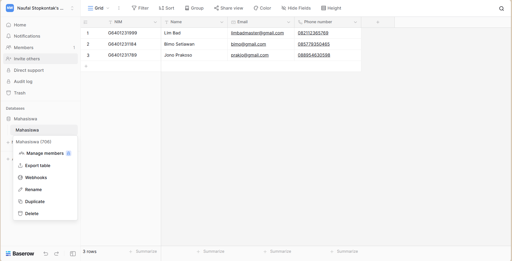

Pilih format export, pemisah kolom, dan encoding. Klik **Export** lalu download.

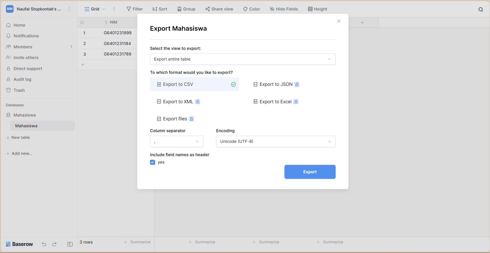

---

## 🤖 Otomatisasi

Script berikut mengotomatiskan seluruh proses instalasi Baserow dari awal.

#### 1. Buat file `setup_baserow_auto.sh`

```bash
#!/usr/bin/env bash
set -euo pipefail

# Konfigurasi default — ubah kalau perlu
REPO_URL="https://gitlab.com/bramw/baserow.git"
BRANCH="main"
APP_DIR="$HOME/baserow"      # direktori tempat aplikasi akan berada

log() {
  echo "[$(date +'%Y-%m-%d %H:%M:%S')] $*"
}

input_var() {
  local prompt="$1"
  local varname="$2"
  local hidden="${3:-0}"
  if [ "$hidden" -eq 1 ]; then
    read -rp "$prompt: " -s val
    echo
  else
    read -rp "$prompt: " val
  fi
  eval "$varname=\$val"
}

install_dependencies() {
  log "Memperbarui apt & install docker, docker-compose, git"
  sudo apt update -y
  sudo apt install -y docker docker-compose git
  sudo usermod -aG docker "$USER"
}

fetch_repo() {
  if [ -d "$APP_DIR" ]; then
    log "Repo sudah ada — menarik perubahan"
    cd "$APP_DIR"
    git fetch origin
    git reset --hard origin/"$BRANCH"
  else
    log "Cloning repo"
    git clone "$REPO_URL" "$APP_DIR"
    cd "$APP_DIR"
  fi
}

setup_env() {
  cd "$APP_DIR"
  if [ -f .env.example ]; then
    cp .env.example .env
  else
    log "File .env.example tidak ditemukan, membuat .env baru"
    touch .env
  fi

  input_var "SECRET_KEY (untuk Baserow backend): " SECRET_KEY 1
  input_var "Database password: " DB_PASSWORD 1
  input_var "Redis password: " REDIS_PASSWORD 1
  input_var "Public URL (contoh: https://domainanda.com): " BASEROW_PUBLIC_URL

  if [ -z "$SECRET_KEY" ] || [ -z "$DB_PASSWORD" ] || [ -z "$REDIS_PASSWORD" ] || [ -z "$BASEROW_PUBLIC_URL" ]; then
    echo "Error: Semua nilai wajib diisi." >&2
    exit 1
  fi

  set_env() {
    local key="$1"
    local val="$2"
    if grep -qE "^${key}=" .env; then
      sed -i "s~^${key}=.*~${key}=${val}~" .env
    else
      echo "${key}=${val}" >> .env
    fi
  }

  set_env "SECRET_KEY" "$SECRET_KEY"
  set_env "DATABASE_PASSWORD" "$DB_PASSWORD"
  set_env "REDIS_PASSWORD" "$REDIS_PASSWORD"
  set_env "BASEROW_PUBLIC_URL" "$BASEROW_PUBLIC_URL"

  log ".env disiapkan"
}

deploy_docker_compose() {
  cd "$APP_DIR"
  log "Menjalankan docker-compose up -d"
  docker-compose up -d
}

setup_firewall() {
  log "Membuka port 80, 443, ssh"
  sudo ufw allow 80/tcp
  sudo ufw allow 443/tcp
  sudo ufw allow ssh
  sudo ufw --force enable
}

main() {
  log "Mulai otomatisasi setup Baserow"
  install_dependencies
  fetch_repo
  setup_env
  deploy_docker_compose
  setup_firewall
  log "Selesai. Akses aplikasi di: $BASEROW_PUBLIC_URL"
}

main "$@"
```

#### 2. Jadikan Executable

```bash
chmod +x setup_baserow_auto.sh
```

#### 3. Jalankan Script

```bash
./setup_baserow_auto.sh
```

---

## 📖 Cara Pemakaian

### 1. Login

Sebelum menggunakan aplikasi, lakukan login terlebih dahulu.

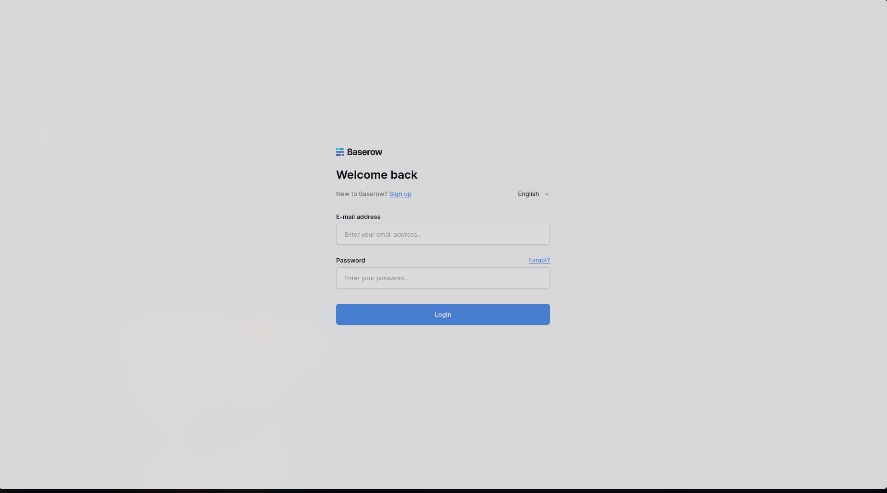

### 2. Halaman Home

Setelah login, akan masuk ke halaman home Baserow. Sidebar menampilkan berbagai pilihan navigasi.

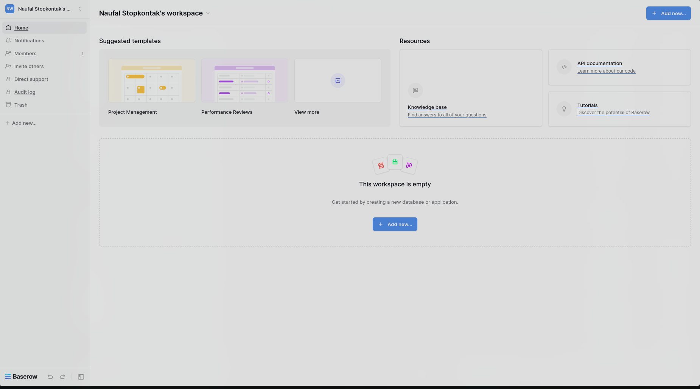

### 3. Membuat Database Baru

Klik **Add new** pada sidebar dan pilih **Database**.

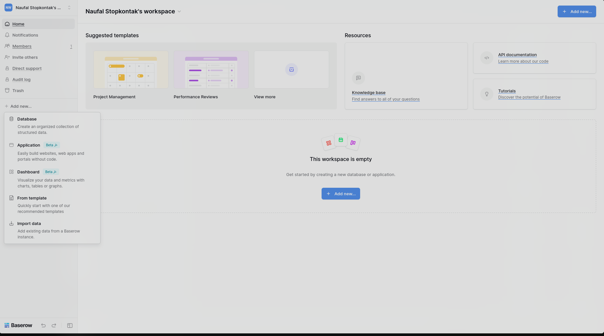

Pilih untuk membuat database baru atau import database yang sudah ada.

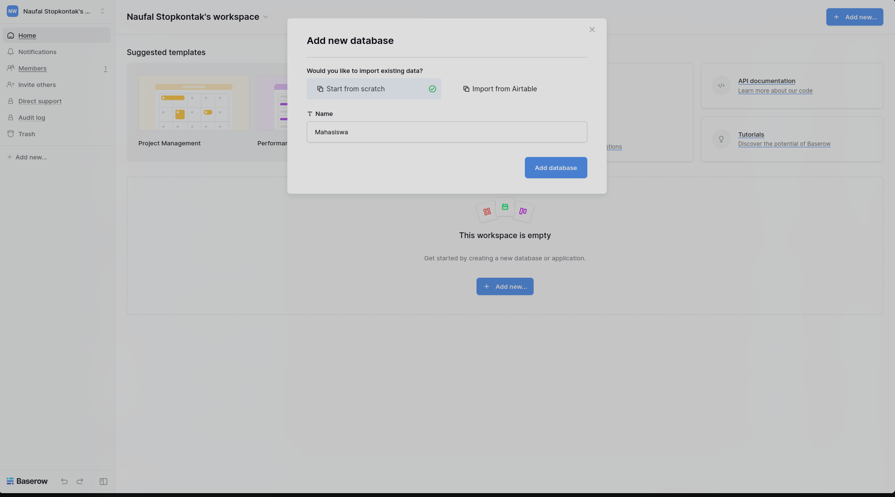

### 4. Mengelola Tabel

Setelah database dibuat, tambahkan tabel dan atur kolom-kolomnya.

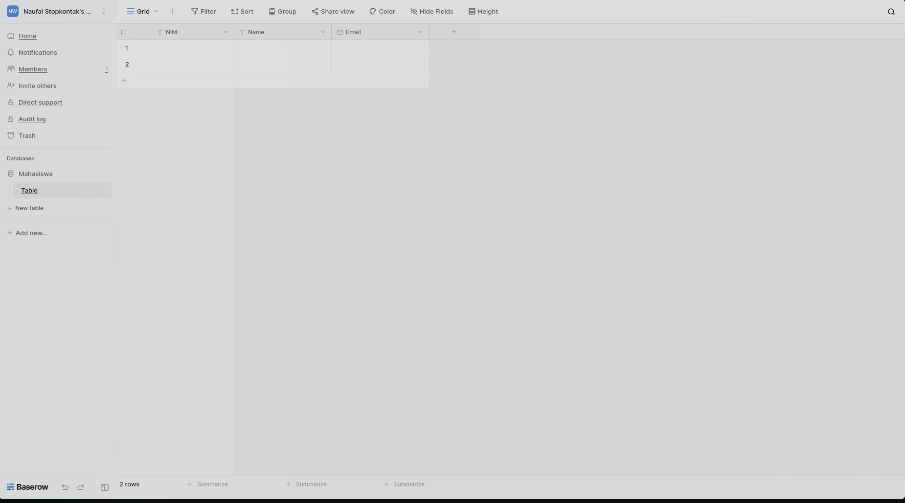

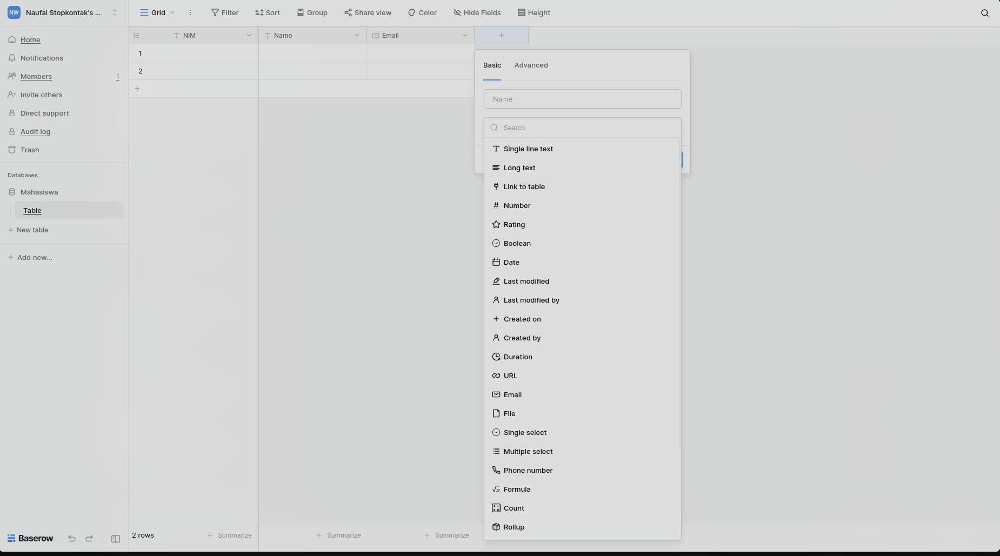

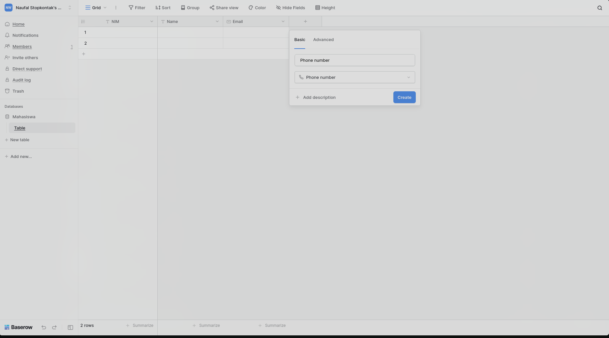

### 5. Tabel Mahasiswa

Contoh tabel mahasiswa dengan kolom: NIM (primary key), Nama, Email, dan Phone Number.

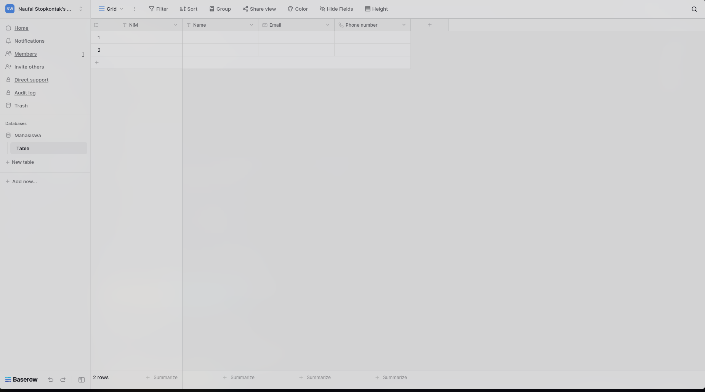

### 6. Mengisi Data

Klik ikon persegi di sebelah kiri baris untuk membuka form pengisian data.

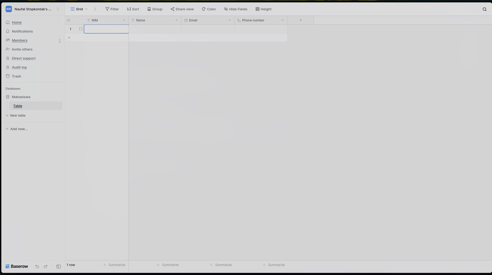

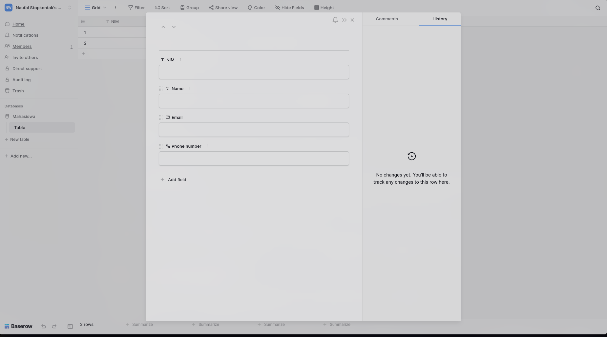

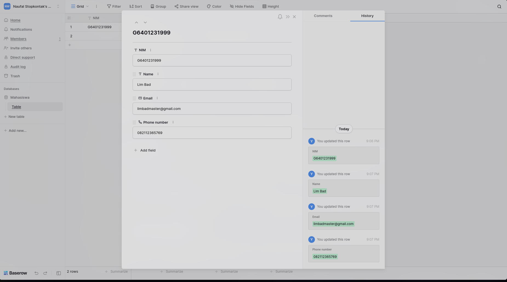

### 7. Hasil Akhir

Tampilan tabel lengkap dengan data dummy.

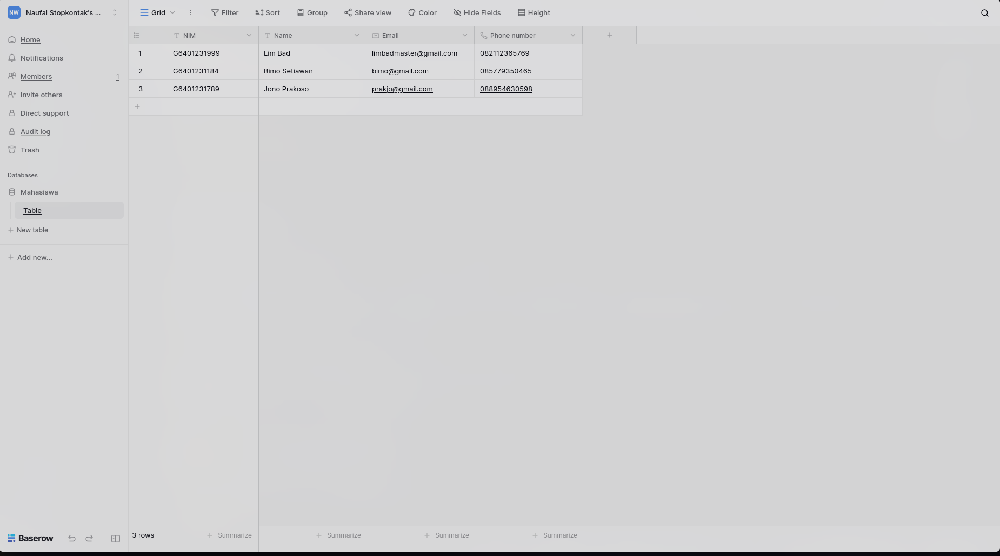

---

## 💬 Pembahasan

**Baserow** adalah platform database no-code open-source yang memungkinkan pengguna membuat dan mengelola database tanpa menulis kode sama sekali.

### ✅ Kelebihan Baserow

| Fitur | Keterangan |
|---|---|
| Antarmuka Familiar | Mirip spreadsheet (Excel/Google Sheets), mudah dipelajari |
| Kolom Fleksibel | Berbagai tipe kolom, relasi antar tabel |
| Kolaborasi Real-time | Beberapa pengguna dapat bekerja bersamaan |
| Open-source & Self-hosted | Kontrol penuh atas data dan privasi |
| REST API | Mudah diintegrasikan dengan aplikasi lain |
| Skalabilitas | Mampu menangani database berjumlah baris sangat besar |

### ❌ Kekurangan Baserow

- Fitur database relasional yang sangat kompleks belum sepenuhnya tersedia
- Komunitas pengguna belum sebesar alternatif yang lebih lama
- Self-hosting memerlukan pemahaman teknis tentang server dan database
- Penggunaan fitur API dan otomatisasi tetap memerlukan sedikit pengetahuan teknis

### 🔄 Perbandingan dengan Limbas

| Aspek | Baserow | Limbas |
|---|---|---|
| Target Pengguna | Bisnis & individu (umum) | Enterprise (manajemen proses bisnis) |
| Kemudahan Penggunaan | ⭐⭐⭐⭐⭐ Sangat mudah | ⭐⭐⭐ Memerlukan waktu belajar |
| Fleksibilitas Data | Bebas sesuai kebutuhan | Terstruktur untuk solusi bisnis spesifik |
| Basis Teknologi | Open-source, modern | Open-source, berbasis PHP |
| Komunitas | Berkembang pesat | Lebih terfokus pada layanan komersial |

---

## 📚 Referensi

1. [Baserow Official Website](https://baserow.io/)
2. [Baserow — GitHub](https://github.com/bram2w/baserow)
3. [Limbas Official Website](https://www.limbas.com/en/)
4. [Limbas — GitHub](https://github.com/limbas/limbas)

---

<div align="center">
  <sub>Dibuat sebagai tugas mata kuliah · Kelompok Satu KDJK</sub>
</div>
